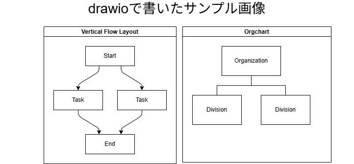

# サンプルスライド
## Marpでスライド作ってみた

  
鈴木駿斗

  
2025年6月

---

## 自己紹介

- 鈴木 駿斗
- 2020年入社、2022年ごろ入会
- 2023年でEX-SCSK
- 料理と野球観戦が趣味(巨人ファン)

---

# 目的
## 毎回スライドを作成するのが面倒だったので、テンプレ化して生成AIに作ってもらえるようにする

---

# drawioをそのまま扱えるのがよい

- `.drawio.png`のように指定するだけでdrawioをエクスポートする必要もない

以降はブログをそのまま出してもらってみます

---

## はじめに

- 埋め込みモデルのDenseとSparseについて
- **Cohere Embed 4**を使用してPDF・パワーポイント資料を画像として埋め込み
- 2025年4月リリースの最新埋め込みモデル

### RAGパイプライン構築の流れ
1. すべての画像の埋め込みを作成し、VectorDBに格納（画像対応）
2. テキスト情報（ユーザーからのクエリ）の埋め込みを生成（テキスト対応）
3. 1,2をマルチモーダル対応モデルに渡すことで回答生成

---

## Cohere Embed 4の特徴

| 観点 | Cohere Embed v4 の特徴 |
|---|---|
| **ベクトル空間の特性** | テキスト・画像・PDF・スライドなど異なるメディアを同じベクトル空間に統合。マルチモーダル検索が可能 |
| **意味理解** | 100以上の言語に対応し、クロス言語でも高精度。規制業界向けのドメイン特化型トレーニングにも対応 |
| **ベクトル次元数** | 256／512／1024／1536次元のマトリョーシカ構造により、用途やコストに応じて次元数を柔軟に選択可能 |
| **距離関数の最適化** | INT8量子化やバイナリ出力形式に対応し、検索速度とストレージ効率の最適化が可能 |
| **大規模文書対応** | 最大128kトークン（約200ページ）を一括処理可能。一貫した意味構造を保ったベクトル化が可能 |

---

## 対応環境

### 主要クラウド環境に対応
エンタープライズレベルでの実運用に適した設計

- **Cohere's platform**
- **Microsoft Azure AI Foundry**
- **Amazon SageMaker**

---

## 使ってみる

### 実験環境
- **LLM**: マルチモーダル対応のGemini2.5
- **ベクターストア**: Qdrant
- **入力データ**: 経済産業省・IPAが公開するPDF・スライドデータ
- **総スライド数**: 62枚の画像として埋め込み
- **ベクトル次元数**: 1536次元（Embed 4のデフォルト）

---

## 実行結果1: QA1 - 表中のデータを聞いてみる

### 結果
- 正解が含まれるデータは**2番目のスコア**（page5）
- Geminiが5枚目のスライドを利用して**正しい回答**を生成

### 評価
✅ **成功**: 適切なデータを取得し、正確な回答を生成

---

## 実行結果2: QA2 - ざっくり資料を聞いてみる

### 結果
- 一番欲しかったのは**3番目のスコア**
- 大きくはブレていない結果
- 回答時には**page10が1番上**に表示

### 評価
⚠️ **部分的成功**: 期待したスコア順位ではないが、大きな外れはなし

---

## 実行結果3: QA3 - 画像の抽象的な意味を聞いてみる

### 結果
- スライド上のテキスト情報を適切に抽出
- **欲しい情報**を正確に取得

### 評価
✅ **成功**: 抽象的な意味理解において良好な結果

---

## まとめ

### 実験結果の総括
- **テキストRAGに比べて実行が早い**ことを体感
- 画像・PDF・スライドなどのマルチモーダルデータに対する検索精度が向上
- Cohere Embed 4の**高い意味理解能力**を確認

### 今後の展望
- より大規模なデータセットでの検証
- 距離指標の最適化による精度向上
- エンタープライズ環境での実運用検討

---

## 参考情報

### 注意事項
- 最終的な回答精度はLLM（Gemini）のモデル精度に依存
- 回答部分は簡易実装（プロンプトに画像データを含めるだけ）
- スコアはQdrantのデフォルト距離指標（コサイン類似度）を使用

### 実装について
- ソースコードはローカル環境で実行可能
- 好きな資料を入れて試すことができる
- 参考ノートブックに基づいた実装